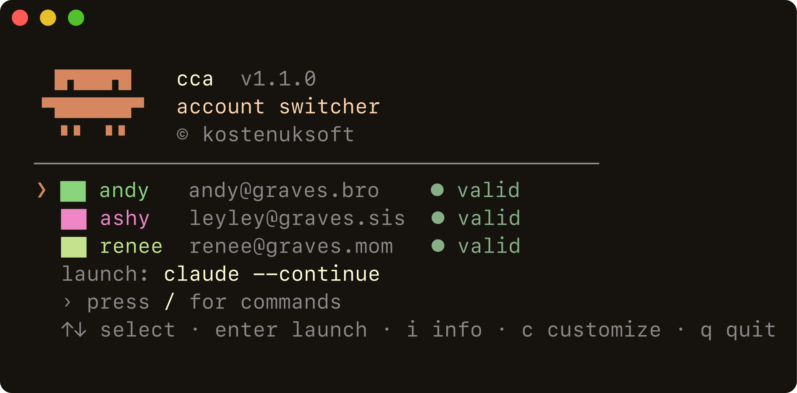
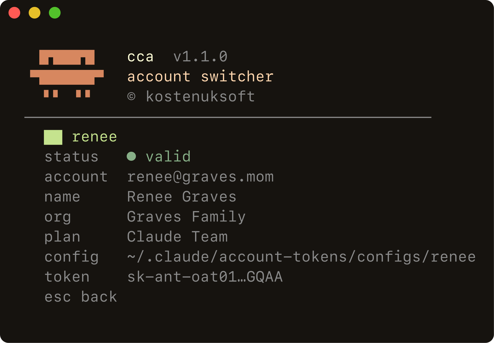
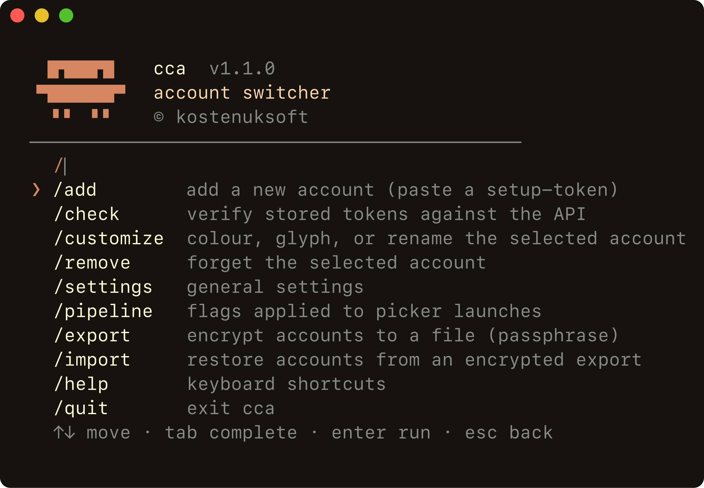
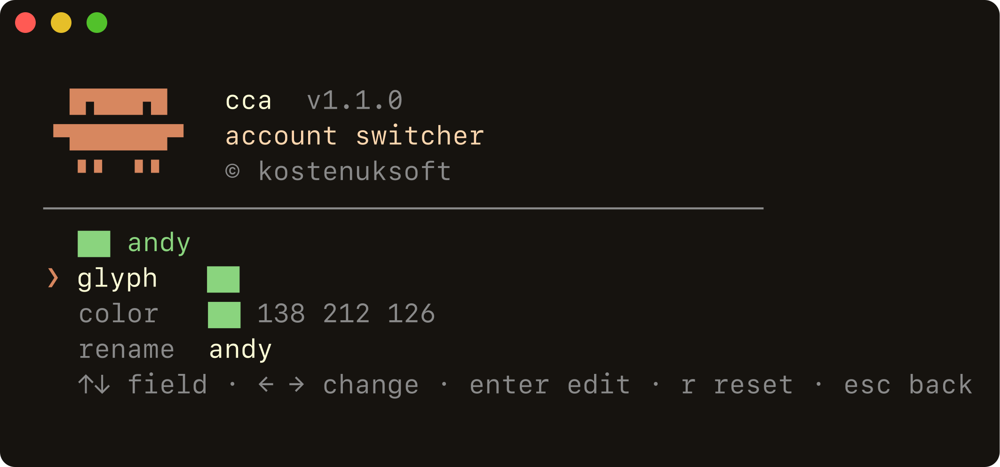
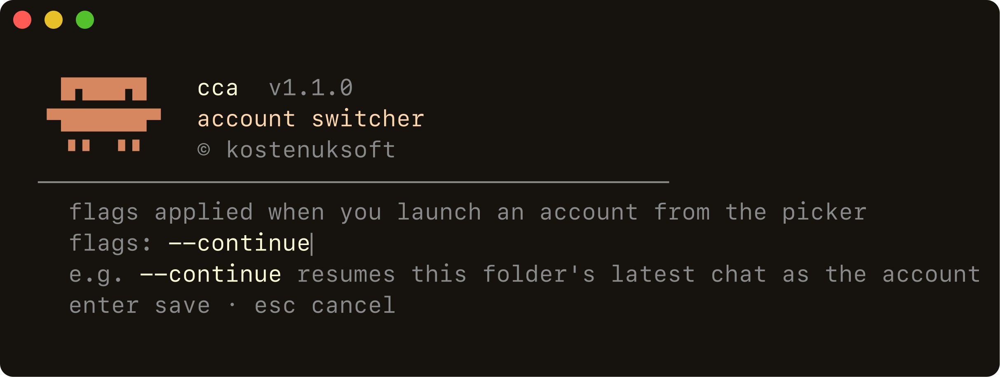
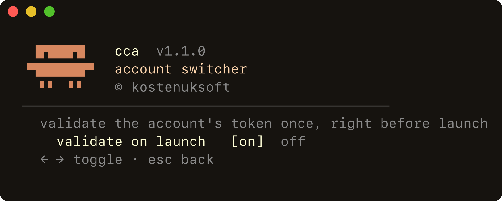

# cca — claude account switcher

 

Run Claude Code as any of several accounts without logging in and out. Store a token per account once; after that `cca work` drops you straight into a session as that account. Your everyday `/login` is never touched.



One tool in [**cctk**](../README.md). Node ≥ 23.6 (or Bun) runs the TypeScript directly — no build step, no runtime dependencies.

## Install

```
curl -fsSL https://raw.githubusercontent.com/kostenuksoft/cctk/master/cca/install.sh | sh
```

From a clone, `cd cca && ./install.sh` wires the checkout in place. Windows: `install.ps1`. See the [cctk README](../README.md) for install options and uninstall.

## Accounts

A token is minted while you're signed into the account it belongs to:

1. Sign your browser into the account.
2. `claude setup-token` — prints a token good for about a year.
3. `cca add work` and paste it. It's checked against the API, then encrypted into your OS keyring.

Then launch: `cca work`, or pass anything straight through to `claude`:

```
cca work --resume
cca personal -p "summarize this repo"
```

|  |  |  |
| - | - | - |
| `cca` |  | open the picker |
| `cca <name> [args]` |  | launch as `<name>`, args pass through |
| `cca add\|remove\|list` | `-a` `-r` `-l` | manage accounts |
| `cca check\|info <name>` | `-c` `-i` | token status / account details |
| `cca color\|glyph <name>` |  | style the account |
| `cca pipeline [flags]` |  | flags the picker adds on launch |
| `cca settings` |  | general settings |
| `cca export\|import <file>` |  | encrypted backup / restore |

`cca info <name>` (or `i` in the picker) shows who an account is, its plan, and the token status:



## The picker

`cca` with no arguments opens a full-screen picker (no scrollback left behind; long lists scroll). Arrows or `j`/`k` to move, `Enter` twice to launch, `i` for details, `c` to customise, `q` to quit. Press `/` for a filterable command menu — everything the CLI does, without leaving the picker.



Each account has a colour (from its name, or set your own) and an optional glyph. Do it inline with `c` — live preview, arrow through colours and glyphs, type an exact RGB, rename, or reset:



## A launch pipeline

Give the picker a fixed set of `claude` flags to add on every launch — set it once in `/pipeline` (or `cca pipeline <flags>`), and the picker shows exactly what it'll run:



The pipeline is the picker's default only — passing your own arguments (`cca <name> …`) ignores it. Put `--continue` in there and every pick resumes this folder's latest conversation as the chosen account.

## Continue a conversation on another account

Hit a limit mid-task, or want to finish on a different account? Exit your session, then:

```
cca work --continue            # carry the current conversation over to work
cca work --resume <id> [args]  # a specific session, plus any claude flags
```

`cca` copies the conversation's transcript into the target account's directory and resumes it there. The original is left as it was — you're just picking it back up as someone else. From the picker, put `--continue` in your pipeline to do this on every launch.

## Tokens and checks

Tokens last about a year, so `cca` doesn't poll. The `● valid` marks in the picker are the last known result, cached on disk — opening it costs nothing. `cca check` verifies on demand, and by default `cca` checks the one account you're launching right before it starts, so you don't drop into a dead session. Toggle that in `/settings`.



## Sharing between machines

`cca export backup.json` writes an encrypted file — accounts, tokens, colours, and glyphs — behind a passphrase (scrypt + AES-256-GCM). `cca import backup.json` restores it into the keyring on another machine; both are in the picker too (`/export`, `/import`), and each asks where to read or write. Your local settings are left alone. No plaintext; a wrong passphrase fails cleanly; a forgotten one means re-minting. Chat history stays local.

## How it works

Claude Code's [auth precedence](https://code.claude.com/docs/en/iam#authentication-precedence) puts `CLAUDE_CODE_OAUTH_TOKEN` above the on-disk login, so an injected token wins for that launch. But a token also makes Claude Code rewrite `.credentials.json` in whatever config dir it runs in — point that at `~/.claude` and it clobbers your login. So each account gets its own directory:

```
~/.claude/account-tokens/
├── accounts.json    names only, never secrets
├── meta.json        colour + glyph
├── settings.json / statuses.json
└── configs/<name>/  isolated CLAUDE_CONFIG_DIR
```

`cca <name>` launches `claude` with the token and `CLAUDE_CONFIG_DIR=configs/<name>` set on the child only — it never reaches your shell.

## Security

- Tokens are encrypted at rest in your OS keyring (libsecret / DPAPI / Keychain); only names are stored in the clear.
- On exit, `cca` deletes the config dir's `.credentials.json` — the only copy at rest is the encrypted keyring one.
- `remove` clears the keyring entry, index, colour, cached status, and config dir. `export` files are passphrase-encrypted.
- Your main `~/.claude` login is never read or written. Plain `claude` still runs as your usual account.
