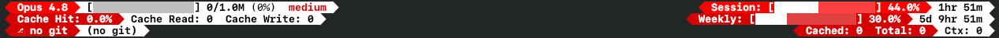
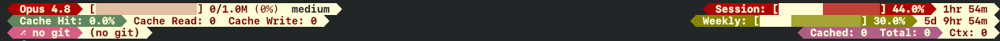

# statusline


A dense, powerline-style status line for Claude Code. Three rows — context window, cache and token accounting, git plus rate-limit windows — packed left and docked right across the full width. Pure Python standard library: one file, no dependencies, no build step beyond pointing Claude Code at it.

<p align="center">
  
</p>

One tool in [**cctk**](../README.md).

## Install

The installer copies `statusline.py` into your Claude Code config dir and wires it into `settings.json` — backing up the old settings first, preserving any other keys (`padding`, `refreshInterval`, …), and staying idempotent on re-runs.

```sh
curl -fsSL https://raw.githubusercontent.com/kostenuksoft/cctk/master/statusline/install.sh | sh
```

```powershell
irm https://raw.githubusercontent.com/kostenuksoft/cctk/master/statusline/install.ps1 | iex
```

From a clone: `cd statusline && ./install.sh` (or `./install.ps1` on Windows). Open a new Claude Code session to see it. Remove it again with `./install.sh --uninstall` — that drops the `statusLine` key and keeps the rest of your settings.

<details>
<summary>Or wire it by hand</summary>

Claude Code feeds status-line data to a command on stdin as JSON. Point it at the file yourself in `settings.json`:

```json
{
  "statusLine": {
    "type": "command",
    "command": "python3 /path/to/statusline.py"
  }
}
```

See the [status line docs](https://code.claude.com/docs/en/statusline) for where `settings.json` lives.

</details>

> [!NOTE]
> The installer needs `python3` on `PATH` — both to run the status line and to edit `settings.json` safely. Nothing else.

## What each row shows

| Row | Left | Right |
|-----|------|-------|
| 1 | model name · context bar `tokens/window (%)` · reasoning effort | **Session** — 5-hour rate-limit bar + reset timer |
| 2 | cache hit rate · cache read · cache write | **Weekly** — 7-day rate-limit bar + reset timer |
| 3 | git branch · working-tree changes | cached / total / context token counts |

The context bar's denominator is the real window size Claude Code reports (`context_window_size`), so it reads correctly at 200K or 1M. When a rate-limit window is absent from the payload it shows `n/a` rather than a fake `0%`. The rows dock to both edges, so the right group stays put as the terminal widens.

## Themes

The default is `scarlet-white` (above). Here's `tcoaal`, whose four accent segments borrow a character palette:

<p align="center">
  
</p>

| palette | look |
|---|---|
| `scarlet-white` *(default)* | bright red on white |
| `ember` | coral + brick + cream |
| `roses-in-autumn` | rose + rust + warm cream |
| `sakura` | blossom-rose + plum + pale pink |
| `tcoaal` | crimson + character colours + bone |
| `sadness-and-sorrow` | steel-blue + slate + periwinkle |

Switch anytime — the status line doubles as its own CLI, and an unambiguous prefix is enough:

```sh
python3 ~/.claude/statusline.py palettes      # list; * marks the active one
python3 ~/.claude/statusline.py palette tco    # → tcoaal
python3 ~/.claude/statusline.py palette        # print the active palette
```

That writes your choice to `${CLAUDE_CONFIG_DIR:-~/.claude}/statusline.json`, which you can also edit directly:

```json
{ "palette": "ember" }
```

Define your own palettes there too. Each has four roles, plus optional per-segment accents:

```json
{
  "palette": "mine",
  "palettes": {
    "mine": {
      "header": 39, "accent": 60, "base": 231, "ink": 16,
      "cache": 65, "git": 168, "weekly": 100, "cached": 132
    }
  }
}
```

`header` colours the model and Session pills, `accent` the rest, `base` the light value pills, and `ink` the text on them. The optional `cache` / `git` / `weekly` / `cached` override `accent` on just those segments — that's how `tcoaal` gets four distinct colours. Values are [xterm-256 codes](https://www.ditig.com/256-colors-cheat-sheet). `STATUSLINE_PALETTE=<name>` overrides everything for a single session.
